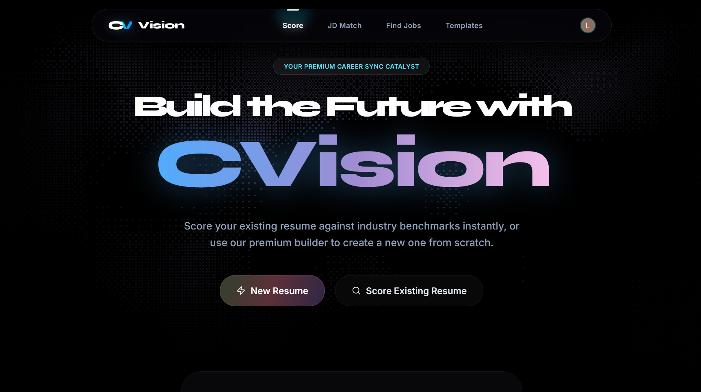
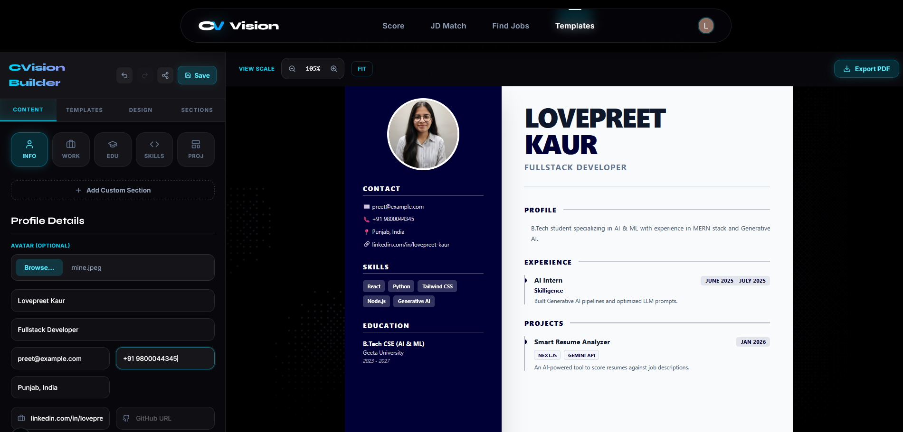
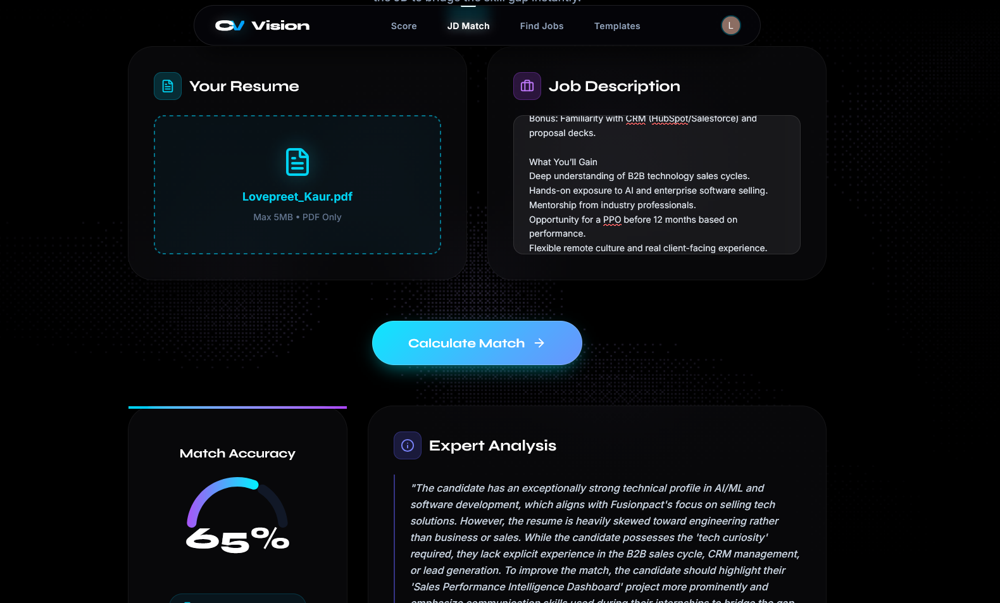
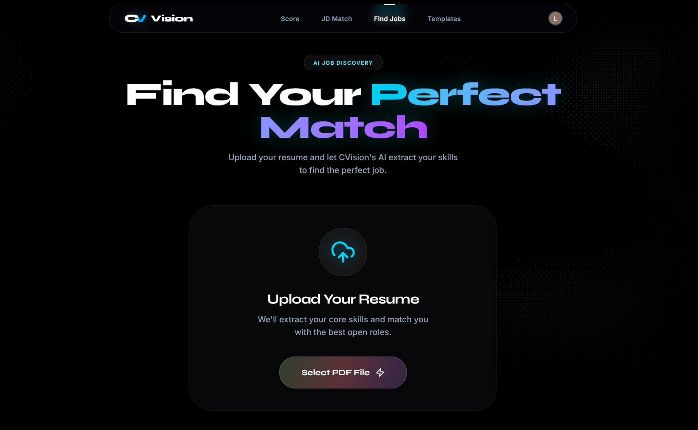
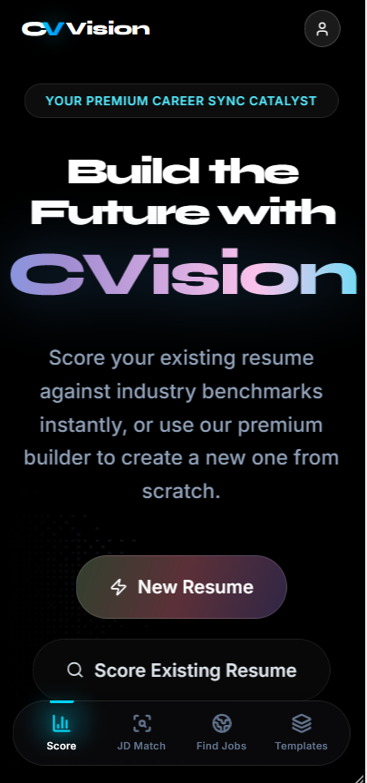

# CVision — Resume Intelligence Platform

> *Syncing Talent with Technology*

[](https://ai-cvision.vercel.app)
[](https://nextjs.org)
[](https://tailwindcss.com)
[](https://supabase.com)
[](https://clerk.com)
[](LICENSE)

---

## Overview

CVision is a full-stack, AI-powered resume intelligence platform built to help candidates navigate the challenges of modern hiring. By combining real-time AI content generation, ATS keyword alignment, and professional PDF export, CVision gives job seekers a measurable edge — from first draft to final application.

Built on a modern Next.js architecture with enterprise-grade authentication and cloud infrastructure, CVision is designed for reliability, performance, and scale.

---

## Live Demo

**[https://ai-cvision.vercel.app](https://ai-cvision.vercel.app)**

---

## Screenshots

<p align="center">
  
  
</p>
<p align="center">
  
  
</p>
<p align="center">
  
</p>

---

## Key Features

### AI-Powered Content Enhancement
Real-time optimization of bullet points, professional summaries, and skill sections powered by Google Gemini 2.0 Flash, tailored to match job-specific language and tone.

### Smart ATS & Job Description Alignment
Automated keyword extraction and semantic mapping against target job descriptions, helping resumes pass screening algorithms before they reach a human recruiter.

### Professional Resume Templates
Multiple ATS-friendly, visually polished layout options designed to render cleanly across all major applicant tracking systems and PDF viewers.

### One-Click PDF Export
High-fidelity PDF generation that preserves formatting and remains fully parseable by ATS engines.

### Live Resume Sharing
Unique, publicly accessible resume links (`/r/[id]`) that candidates can share directly with recruiters without file attachments.

### Integrated Job Discovery
Built-in job finder that surfaces relevant opportunities based on the candidate's resume profile, enabling a seamless apply-anywhere workflow.

### Secure, Authenticated Storage
All resume data is stored securely with Supabase (PostgreSQL) and protected by Clerk-based authentication, ensuring user data privacy and access control.

---

## Technology Stack

| Layer | Technology |
|---|---|
| Frontend | Next.js 16, React, Tailwind CSS, Lucide Icons |
| Backend | Next.js API Routes, Server Actions |
| Database | Supabase (PostgreSQL) |
| AI Integration | Google Generative AI (Gemini 2.0 Flash) |
| Authentication | Clerk |
| Deployment | Vercel |

---

## Getting Started

### Prerequisites

- Node.js 18+
- A [Supabase](https://supabase.com) project
- A [Clerk](https://clerk.com) application
- A [Google Gemini](https://ai.google.dev) API key

### Installation

**1. Clone the repository**

```bash
git clone https://github.com/Lovepreet-Kaur-Gill/CVision.git
cd CVision
```

**2. Install dependencies**

```bash
npm install
```

**3. Configure environment variables**

Create a `.env.local` file in the root directory:

```env
# Authentication — Clerk
NEXT_PUBLIC_CLERK_PUBLISHABLE_KEY=pk_test_...
CLERK_SECRET_KEY=sk_test_...
NEXT_PUBLIC_CLERK_SIGN_IN_URL=/sign-in

# Database — Supabase
NEXT_PUBLIC_SUPABASE_URL=https://your-project.supabase.co
NEXT_PUBLIC_SUPABASE_ANON_KEY=your-anon-key

# AI — Google Gemini
GEMINI_API_KEY=your-api-key
```

**4. Start the development server**

```bash
npm run dev
```

Open [http://localhost:3000](http://localhost:3000) in your browser.

---

## Project Structure

```
CVision/
├── app/                  # Next.js App Router pages and layouts
├── components/           # Reusable UI components
├── lib/                  # Utility functions and API clients
├── public/               # Static assets and screenshots
└── styles/               # Global styles
```

---

## Roadmap

- Multi-language resume support
- LinkedIn profile import
- Cover letter AI generation
- Recruiter-side dashboard for bulk resume review
- Resume version history and A/B comparison

---

## Contributing

Contributions are welcome. To get started:

1. Fork the repository
2. Create a feature branch (`git checkout -b feature/your-feature`)
3. Commit your changes (`git commit -m 'Add your feature'`)
4. Push to the branch (`git push origin feature/your-feature`)
5. Open a Pull Request

Please review open issues before submitting new ones, and follow the existing code style.

---

## License

This project is licensed under the [MIT License](LICENSE). You are free to use, modify, and distribute this software with attribution.

---

## Author

**Lovepreet Kaur Gill**
[GitHub](https://github.com/Lovepreet-Kaur-Gill) · [Live Project](https://ai-cvision.vercel.app)

---

*CVision — Built to get resumes seen by the right people.*
